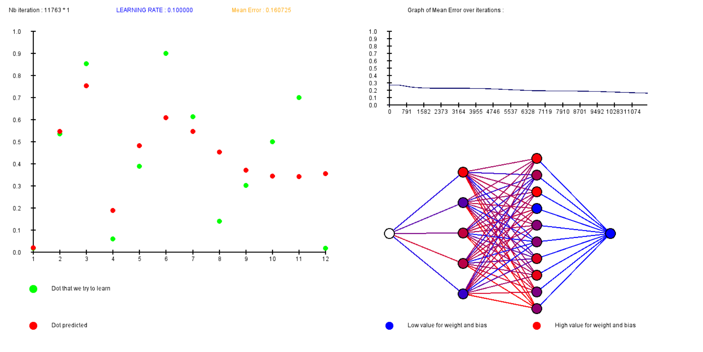

# 🧠 Neural Network From Scratch with Real-Time Visualization (C + Allegro)
This project implements a simple neural network from scratch in C. It learns to approximate basic target functions through supervised learning, using gradient descent and backpropagation. What makes this project unique is its real-time graphical visualization using the Allegro graphics library.

# 🚀 Features
  🧩 Fully custom neural network implementation in C (no external ML libraries)

  
  📈 Live training visualization, including:

    - 🔵 Left side: graph showing target values vs. predicted values

    - 🧮 Top-right: automatic graph of mean error over iterations

    - 🕸️ Bottom: dynamic visualization of the neural network itself (node color reflects activation values)

  🛠️ Simple training on arbitrary datasets (hardcoded on a .txt)

# 📦 Dependencies
  ⚙️Allegro 5 (graphics library)

# 📝 How to Build
  You’ll need a C compiler and Allegro 5 installed. 
  Training happens in real-time — you can see the network learn.

# P.S. 
✍️ I coded this in 2023-2024 so it is not so well optimized !
