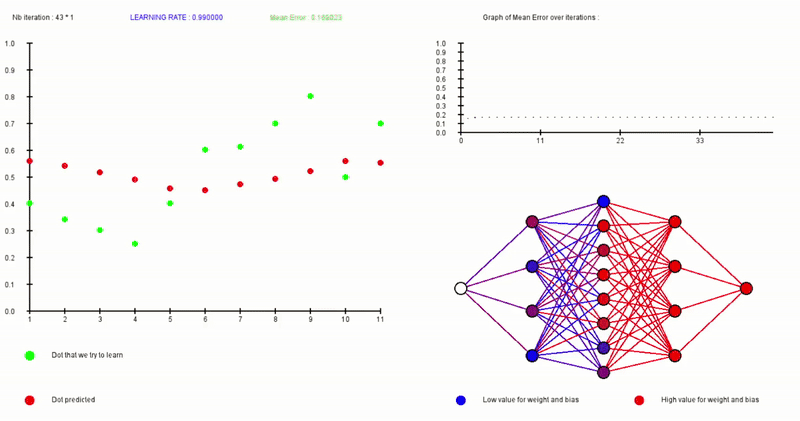
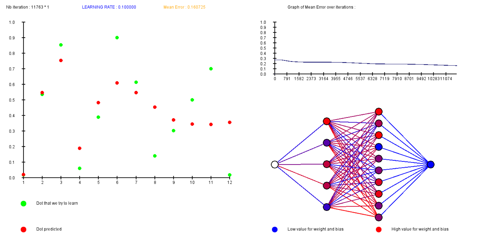

# 🧠 Neural Network From Scratch


  

  
  

<p align="center">
  
</p>

## 📝 Project Description  
Welcome to my first big project : **Neural Network From Scratch** 🧠 **with Real-Time Visualization (C + Allegro)** !  
This project implements a simple neural network from scratch in C. It learns to approximate basic target functions through supervised learning, using gradient descent and backpropagation.  

What makes this project unique is its **real-time graphical visualization** using the Allegro graphics library : We are able to see the difference between targets and outputs, graph for the loss and visualisation of the network🕸️.

---

# 🚀 Features
  🧩 Fully custom neural network implementation in C (no external ML libraries)

## Example Outputs  
  
  📈 Live training visualization, including:

    - 🔵 Left side: graph showing target values vs. predicted values

    - 🧮 Top-right: automatic graph of mean error over iterations

    - 🕸️ Bottom: dynamic visualization of the neural network itself (node color reflects activation values)

  🛠️ Simple training on arbitrary datasets (hardcoded on donnees.txt)  

---

## ⚙️ How it works
- 🧠 Input layer: takes in data (here what is in donnees.txt)
- 🔗 Weights & biases: adjust how much each input matters
- ➕ Summation: combines inputs with weights
- 🎚️ Activation function: decides if the neuron “fires” (here we use the sigmoid fonction)
- 🏗️ Hidden layers: repeat process to learn complex patterns
- 🎯 Output layer: produces final result / prediction
- 🔄 Training: network compares result to truth, adjusts weights (backpropagation)
- 📈 Iteration: repeats until error is minimized


---

## 📂 Repository structure  
```bash
├── Images/                      # For the README.md
├── neuron_network_clear/
| ├── cmake-build-debug/
| ├── 1_fwd_propagation.c        # Forward propagation calcul
| ├── 1_fwd_propagation.h
| ├── 2_back_propagation.c       # Back propagation calcul
| ├── 2_back_propagation.h
| ├── Arial.ttf                  # Font file
| ├── CMakeLists.txt
| ├── affichage_tableau.c        # Allegro display
| ├── affichage_tableau.h
| ├── calcul.c                   # Different calcul (sigmoid / relu / MSE / etc. )
| ├── calcul.h
| ├── creator.c                  # Manage the mamory for each structure
| ├── creator.h
| ├── donnees.txt                # Here is the data the NN will learn ! You can add what ever you want.
| ├── main.c                     # Run this to start the program
| ├── structure.h
| ├── training.c                 # Do the iteration of training
| ├── training.h
├── LICENSE
├── README.md
```

---

## 💻 Run it on Your PC
Clone the repository and install dependencies:

```bash
# Clone the repository
git clone https://github.com/Thibault-GAREL/Neural_Network_from_Scratch.git
cd Neural_Network_from_Scratch

# Install dependencies (Linux 🐧)
sudo apt-get update
sudo apt-get install -y git cmake liballegro5-dev

# For macOS 🍎 / Windows 🪟, consult the official Allegro documentation:
# https://liballeg.org/

# Build the project
mkdir build && cd build
cmake .. || { echo "CMake failed. Check dependencies."; exit 1; }
make || { echo "Build failed. Check errors above."; exit 1; }

# Run the project (replace with the actual binary name)
./YourBinaryName
```

---

## 📖 Inspiration / Sources  
This project is based on a basic book named "L'intelligence artificielle pour les dévellopeurs" from Virginie MATHIVET.  
It just explain who work a neuron, that's all 🤯 !

---

# ✍️ P.S. 
I coded this in 2023-2024 so it is not so well optimized ! I was a beginner. 😆  
Code created by me 😎, Thibault GAREL - [Github](https://github.com/Thibault-GAREL)
